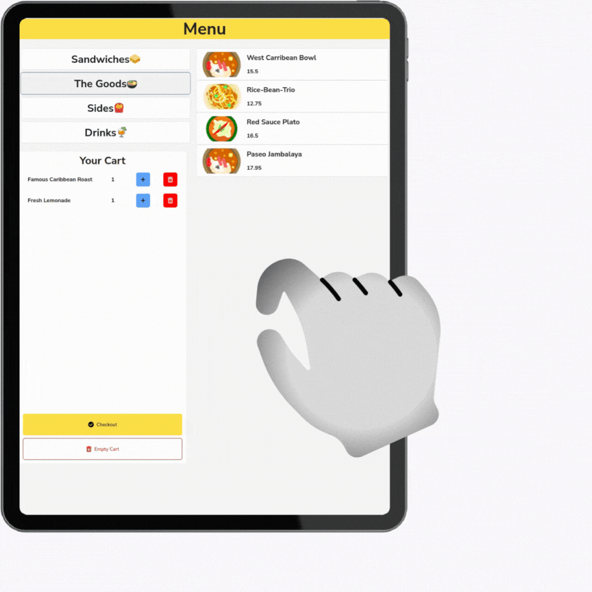
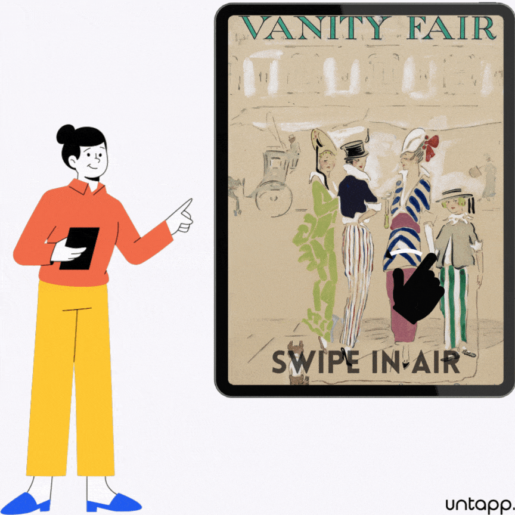
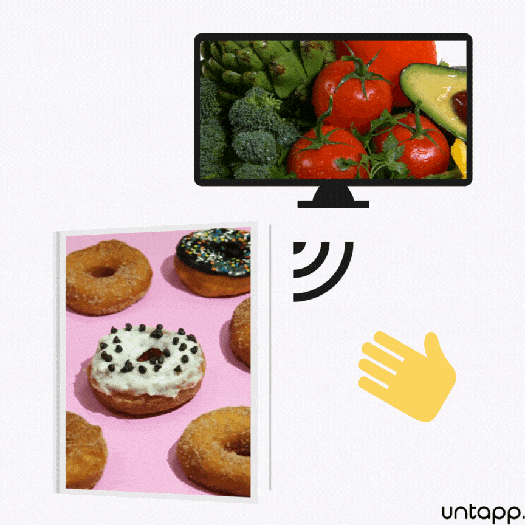



    <h1 class="display-5 fw-bold mb-4">Welcome to the future of customer experiences!</h1>
    

        
Untapp's touchless interactive kits let you serve your customers quickly, safely,
            efficiently.

        

            <a href="/#Interested"><button type="button" class="btn btn-primary btn-lg px-4 gap-3">Get
                    Started</button></a>
        

    

    <!-- START THE FEATURETTES -->

    

        

            <h2 class="featurette-heading">Untapp's Self-Ordering Solutions provide a frictionless experience.
            </h2>
            
Customers love convenience. With Untapp's self-ordering solutions you can eliminate long
                waiting queues, free up staff, and let customers order with ease.

            <ol class="list-unstyled mb-0">
                <li class="mb-2">
                    <i class="fas fa-check text-primary me-3"></i> Faster service times
                </li>
                <li class="mb-2">
                    <i class="fas fa-check text-primary me-3"></i> Upsell more, increase order sizes
                </li>
                <li class="mb-2">
                    <i class="fas fa-check text-primary me-3"></i> Serve customers 24x7
                </li>
            </ol>
        

        

            
        

    

    

        

            <h2 class="featurette-heading">Touch-less technology makes interactions safe and
                    hygienic.
            </h2>
            
Untapp's kit-enabled screens eliminate the need for physical contact, by letting users
                interact via hand gestures. This reduces the spread of germs and provides a safer environment for
                everyone.

        

        

            
        

    

    

        

            <h2 class="featurette-heading">Your choice of canvas and art, made immersive and
                    interactive.
            </h2>
            
Untapp's kits work on all screen-types (HDMI/VGA) of all sizes, delivering HD quality
                experiences.

            
These screens can display interactive content of your choice, or can deploy applications
                custom-made for you.

        

        

            
        

    

    

        

            <h2 class="featurette-heading">Designed like a Swiss-army knife. Many needs, one
                    solution.
            </h2>
            
Deploy interactive screens in your field of industry, as per your needs. Form follows
                function.

            <ol class="list-unstyled mb-0">
                <li class="mb-2">
                    <i class="fas fa-check text-primary me-3"></i>Retail: Self-serve and
                        Point-of-Sale kiosks, product signage
                </li>
                <li class="mb-2">
                    <i class="fas fa-check text-primary me-3"></i>Hospitality: Automated
                        Check-in, Know-Your-Customer process
                </li>
                <li class="mb-2">
                    <i class="fas fa-check text-primary me-3"></i>Smart public spaces: Info
                        kiosks, Wayfinders, promotional signage
                </li>
            </ol>
        

        

            <!--  -->
            <video class="bd-placeholder-img bd-placeholder-img-lg featurette-image img-fluid mx-auto d-block"
                autoplay="" loop="" muted="true" playsinline="" id="application_video">
                <source src="./assets/images/applications_video.mp4" type="video/mp4" width="500" height="500"
                    alt="Untapp Interactive screens can be deployed in any industry to fulfil requirements." />
            </video>

        

    

<!-- /END THE FEATURETTES -->

<!-- About -->

    

        <h1 class="display-5 fw-bold mb-4"><strong>Say Hello to Untapp!</strong></h1>
        

            
The Untapp Kit consists of a Player Unit and a simple RGB camera. It turns any
                Television or monitor into an interactive screen, controllable by a user's hand gestures.

            

                <a href="/#Interested"><button type="button" class="btn btn-primary btn-lg px-4 me-sm-3 fw-bold">Get
                        Started</button></a>
            

            

                

                    
                

            

        

    

<!-- Key Features -->
<!-- <h1 id="Features" class="text-center mt-5"><strong>Key Features</strong></h1> -->

<!-- icon grid -->

<h1 class="text-center mt-4"><strong>Key Features</strong></h1>

    

        

            <i class="fas fa-4x fa-shopping-cart mb-4 mt-4"></i>
            <h3 class="fw-bold mb-0 fs-4 text-center">Self-Order, self-serve solutions</h3>
            
Untapp's Self-Order solutions display image-aided menus that customers can
                interact with and place their orders on.

        

        

            <i class="fas fa-4x fa-money-check-alt mb-4 mt-4"></i>
            <h3 class="fw-bold mb-0 fs-4 text-center">Online Payment Options</h3>
            
Customers can securely pay for their orders via UPI scanning options
                provided at the end of every order, or can pay in person to the cashier. Their choice.

        

        

            <i class="fas fa-4x fa-smile mb-4 mt-4"></i>
            <h3 class="fw-bold mb-0 fs-4 text-center">Lasting Retail experiences</h3>
            
Untapp's intuitive interactive experiences showcase your products in the
                best way, giving your consumers an unforgettable store experience.

        

        

            <i class="fas fa-4x fa-wallet mb-4 mt-4"></i>
            <h3 class="fw-bold mb-0 fs-4 text-center">Wallet friendly</h3>
            
Untapp's kiosks and digital signage offerings are designed to be
                affordable. With your choice of screen, you can spend only for what you need.

        

        

            <i class="fas fa-4x fa-cube fa-flip mb-4 mt-4"></i>
            <h3 class="fw-bold mb-0 fs-4 text-center">3D interaction</h3>
            
With Untapp's touchless tech, providing 3D experiences to your customers
                is easier than before. Let consumers interact with your stunning products in all its 3-dimensional
                glory!

        

        

            <i class="fas fa-4x fa-shield mb-4 mt-4"></i>
            <h3 class="fw-bold mb-0 fs-4 text-center">Secure</h3>
            
Untapp uses a locked-down linux operating system with regular OTA updates
                and device-signing, limiting any chance of compromising your screens.

        

        

            <i class="fas fa-4x fa-cloud mb-4 mt-4"></i>
            <h3 class="fw-bold mb-0 fs-4 text-center">Cloud Powered</h3>
            
All content and information is safely served through the cloud.

        

        

            <i class="fas fa-4x fa-wifi mb-4 mt-4"></i>
            <h3 class="fw-bold mb-0 fs-4 text-center">Connected by WiFi or Ethernet</h3>
            
Untapp's kits can access the cloud via WiFi or Ethernet.

        

        

            <i class="fas fa-4x fa-virus-slash mb-4 mt-4"></i>
            <h3 class="fw-bold mb-0 fs-4 text-center">Hygienic and safe</h3>
            
Completely-touchless screens mitigate spread of germs through contact.

        

    

    

        

            <h1 class="display-4 fw-bold lh-1 mb-3">Interested? Let us know!</h1>
            
 Just drop in a message here to get in touch with us!

        

        

            <form class="p-4 p-md-5 border rounded-3 bg-light" action="https://formspree.io/f/mknakaeb" method="POST">
                <!-- Name input -->
                

                    <input type="text" name="name" id="form_name" class="form-control" placeholder="John/Jane Doe" />
                    <label class="form-label" for="form_name">Name</label>
                

                <!-- Email input -->
                

                    <input type="email" name="email" id="form_email" class="form-control"
                        placeholder="name@example.com" />
                    <label class="form-label" for="form_email">Email address</label>
                

                <!-- Message input -->
                

                    <textarea class="form-control" name="message" id="form_message" rows="4"
                        placeholder="Let's connect!"></textarea>
                    <label class="form-label" for="form_message">Message</label>
                

                <!-- Submit button -->
                <button class="w-100 btn btn-lg btn-primary" type="submit">Message</button>
            </form>
        

    

